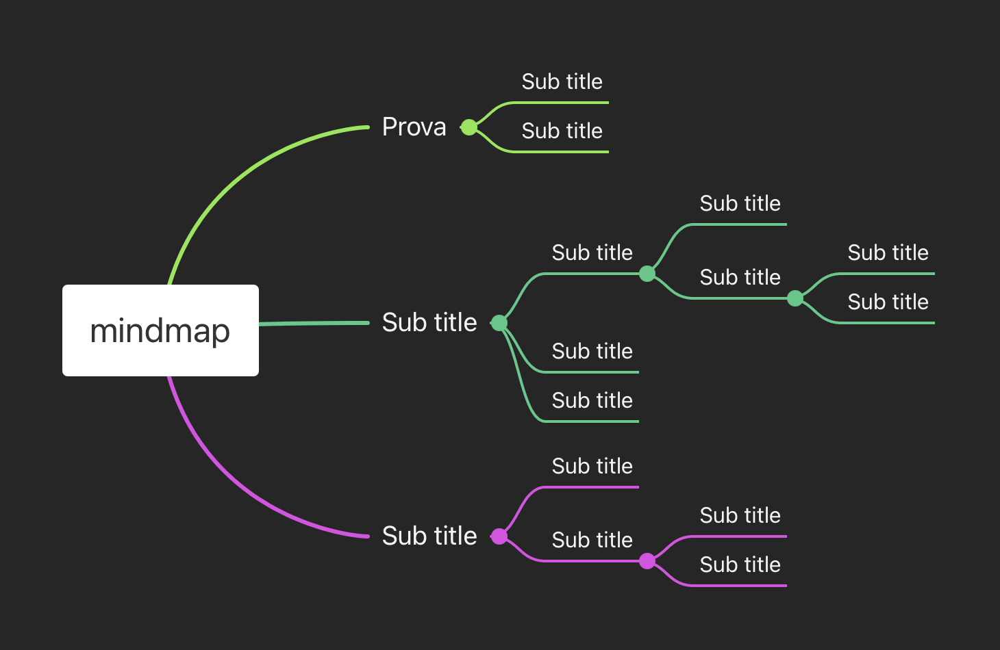



## Saluti e presentazioni

> **test d'ingresso di matematica**: 
> mi è stato comunicato che il giorno `16/09/2021,` durante le prime 3 ore, si terrà il `test d'ingresso di matematica`:
> - **argomenti**
>   - proprietà delle potenze
>   - operazioni con le frazioni

## Presentazione del corso

> $\rightarrow$ ***La matematica non è imparare formule a memoria, bensì collegare tra loro concetti.***

## Il metodo di studio: come si studia la matematica?

> Lo studio delle materie scientifiche

## mindmapping: le mappe mentali

## materiali didattici

> - `Google Classroom`:
>   - comunicazioni
>   - assegnazione compiti (eventualmente anche sul Registro El.)
> - Registro elettronico: `Classeviva Spaggiari`
> - Libro di testo: `**MultiMath Verde** - M. Baroncini, R. Manfredi - vol. 1 - ed. *Ghisetti&Corvi*`
>   - `non strettamente indispensabile in classe`
>   - versione digitale su iPad? `parliamone...`
> - Appunti dalle lezioni
>   - quaderno, suddiviso in 2 parti.
>     1. appunti dalle lezioni
>     2. esercizi
>   - dispense in formato **pdf** con il riassunto della lezione

## La lezione

## La verifica delle competenze:

>- Le **abilità** rappresentano le capacità di applicare le **conoscenze** apprese, con lo scopo di risolvere problemi e portare a termini compiti. 
>- Le **competenze** rappresentano la *capacità di unire conoscenze, abilità e capacità personali, sociali e metodologiche e utilizzarle nello studio e nello sviluppo personale*.

- Nel corso dell'anno verranno valutate

1. **`verifica scritta`**:
   - [esempio verifica](./verifica_es.pdf)
   - [esempio verifica_soluzioni](./verifica_es_sol.pdf)

>**`Q:`** - come viene calcolato il punteggio e come si trasforma nel **voto finale**?
>
>**`A:`** - come viene calcolato il punteggio e come si trasforma nel **voto finale**?

2. **`verifica orale`**:

3. **`controllo quaderni`**: 
- l'attività di controllo dei quaderni serve a garantire una continuità di impegno

4. eventuali **`prove pratiche`**:
- **Flipped-Classroom**: si tratta di un'attività da svolgere in coppie o piccoli gruppi

## conclusioni

- [Presentazione del corso]()
