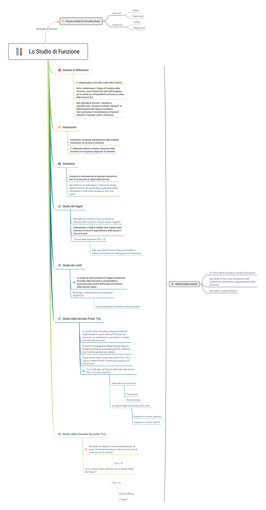



---

## Il Metodo Cornell

> - references:

>Ideato quasi 80 anni fa dal prof. Walter Pauk della Cornell University di New York, **il metodo Cornell** è il sistema più efficace che conosco per prendere appunti.

- Nonostante la sua semplicità – alla fine si tratta di un foglio diviso in 3 parti – il metodo Cornell ti permette di seguire una lezione, una conferenza, una riunione di lavoro:

- Mantenendo la `concentrazione` ai massimi
- Aumentando comprensione e coinvolgimento rispetto a quanto ascolti
- Ritrovandoti alla fine con un materiale chiaro e ordinato, pronto (o quasi) per essere memorizzato

- Vediamo però, prima di tutto, che cosa è che non funziona nella maniera in cui, normalmente, si prendono gli appunti.

## Metodo tradizionale vs Metodo Cornell

- La maggior parte delle persone, quando imparano a prendere appunti, si limitano a cercare di registrare su un foglio di carta le informazioni che ricevono.

- **Ascoltano, cioè, passivamente**, ed altrettanto passivamente trasferiscono sul quaderno quello che ascoltano.

- Nel farlo, il loro cervello è, non dico spento, ma lavora decisamente **a trazione ridotta.**

- E così la concentrazione si abbassa, subentra la noia e ovviamente la qualità totale del lavoro cerebrale crolla.

- Il flusso di informazioni rimane **a uno stato di analisi e manipolazione superficiale**: quello in cui ci si limita a trasformare i suoni in parole di senso compiuto e a metterle su carta.

- Se poi, come fanno in molti, mentre ascolti ti preoccupi soprattutto di trascrivere tutto, non fai altro che aggiungere inefficienza a inefficienza.

Infatti:

- Non ti rimane tempo per pensare, e quindi scompare ogni coinvolgimento intellettuale rispetto a quello che senti
- Poiché è difficile scrivere tutto, il tuo livello di attenzione e comprensione si abbassa ulteriormente. **Sei infatti troppo impegnato a non farti sfuggire neanche una parola!**

- Hai, insomma, **l’illusione di ascoltare**; ma in realtà **stai lavorando più o meno come un registratore,** solo che non sei altrettanto veloce.

- Il **metodo Cornell invece, prescrivendo delle regole precise** di compilazione degli appunti, **ti sfida** a intervenire, fin da subito, sulle informazioni che ricevi.

>In particolare, si tratta di:
>
>- Selezionare, secondo priorità, le informazioni che ti vengono date
>- Concettualizzarle
>- Comprimerle in maniera che siano più corte
>- Organizzarle
>- Prepararle per un ripasso efficace

Ma come funziona nella pratica?

## Le tre sezioni del foglio nel Metodo Cornell

<!--  -->

Prendi un foglio di carta bello grande (io di solito utilizzo quaderni in A3) e dividilo in tre sezioni.

1. Sezione di destra degli appunti Cornell (area A)

- E’ quella in cui vengono presi gli appunti veri e propri.
- In alto, intesta il foglio con quelli che potremmo definire i dati anagrafici della lezione (data, tema, relatore, etc).
- Sotto ad essi, scrivi gli appunti veri e propri, avvalendoti degli stessi principi che abbiamo visto parlando degli *schemi a cascata*:
- Utilizza **parole tue**, ti aiuta a concettualizzare
- Scrivi **liste con bullet point**, ti aiuta a dare ordine e gerarchia alle info
- **Sintetizza come fossi su twitter**, ti aiuta a cogliere l’essenza
- **Abbrevia** le parole come se scrivessi un sms, perché ti obbliga a pensare alla parola che scrivi
- Metti **frecce**, per evidenziare i rapporti logici
- Fai **disegnini** esplicativi, stimolano la parte “visiva” e creativa della tua corteccia
- Commenta ogni tanto quello che scrivi con **note “emotive”** (“Che schifo!” “Interessante!” “Bello!”), ti aiuteranno a memorizzare meglio
- **Varia i caratter****i** usando corsivo, stampatello, maiuscolo, minuscolo, sottolineato etc.

## 2. Sezione di sinistra degli appunti Cornell (Area B)

E’ la sezione dedicata alle **parole chiave**, che devono essere:

1. **Poche**: il meno possibile, anche perché lo spazio a disposizione è volutamente ridotto
2. **Sintetiche**: cioè non frasi, ma singoli sostantivi / aggettivi
3. **Evocative:** devono ricordare il contenuto della sezione di destra sia a livello concettuale che mnemonico

- Sono proprio questo tipo di limiti, non facili da rispettare, a rendere efficace il Metodo Cornell.
- Per scegliere le parole giuste dovrai infatti **spremerti le meningi e mantenere la concentrazione** molto alta.
- Non importa (anzi, è normale) se non riesci a completare questa sezione durante la lezione, potrai farlo in un secondo momento.

>Le parole chiave potrai anche trasformarle poi in immagini ed inserirle in un palazzo della memoria.

## 3. Sezione inferiore degli appunti Cornell (Area C)

- Qui metti un **micro-riassunto** del contenuto delle pagina.
- Inoltre, puoi annotare domande, fare brevi considerazioni, appuntarti promemoria, impressioni, collegamenti, o tutto ciò che il tuo dialogo cerebrale ritiene che sia utile.
- Per es. *Quanto detto mi ricorda che …. Come mai capita X … Vai a rivedere il testo Z … etc.*
- Anche questa parte può essere iniziata durante la lezione, ma viene per lo più svolta dopo.

## Perché il metodo Cornell è efficace

L’efficacia del metodo Cornell si basa su due fatti principali:

1. **Durante la lezione**, ti costringe all’ascolto attivo, e lo rende ancora più performante poiché devi trasferire l’ascolto su carta, chiudendo così il loop cerebrale **ascolto-rielaborazione-azione**. L’info che devi acquisire compie in questa maniera un ciclo completo e diventa molto più stabile anche da un punto di vista mnemonico.
2. **Dopo la lezione**, ti costringe a *lavorare il materiale* in maniera **analitica e sintetica**, e ti permette poi il **ripasso a tre livelli** di dettaglio differenti: quello dei riassunti (sezione inferiore), quello delle parole chiave (sezione sinistra), quello del totale degli appunti (sezione destra), con ciascun livello che può essere ripassato separatamente o insieme agli altri.

>Non solo **quindi impari di più mentre prendi gli appunti**, ma hai anche uno strumento di **studio/ripasso più strutturato e veloce.**

## Conclusioni sul Metodo Cornell

- Molte persone, quando prendono appunti oppure scrivono schemi, sottolineano, fanno mappe, leggono un libro, commettono un errore fondamentale: **mettono tutto sullo stesso piano.**
- Si concentrano cioè sulla quantità delle informazioni, cercando di non farsene sfuggire nessuna.
- Purtroppo, però, l’ansia di non perdersi nulla e di non lasciare indietro una qualche info fondamentale, alla fine li fa lavorare in **maniera meccanica**, per non dire stupida.
- Il risultato, paradossale, è che dopo pochi minuti già non ricordano quasi nulla di quello che scrivono, leggono o sottolineano e i loro appunti o schemi prendono l’aspetto di **muri impenetrabili** di parole.
- Quello che tu devi fare, invece, è **dedicarti agli aspetti qualitativi**, cominciando fin da subito a valutare, analizzare e soprattutto scegliere quello su cui vale la pena concentrarti.
- In questa maniera, grazie allo sforzo mentale che richiedono queste operazioni, comincerai a imparare da subito.

Si tratta di un principio che abbiamo visto molte volte nel blog.

- Quando ti sforzi di manipolare il materiale di studio secondo alcune regole precise, riesci ad aumentare:
- Al contrario, **quando ti comporti in maniera passiva**, sperando che a forza di ripetizioni il materiale si trasferisca, come per osmsosi, nel tuo cervello, i risultati tardano tantissimo tempo a venire.
- Ricorda allora, anche quando utilizzi il metodo Cornell, che se lasci indietro una informazione non è un grande problema: fra internet, sbobinature, libro, appunti altrui, *se essa è davvero importante troverai sempre un tempo e un modo per recuperarla.*

>- Una volta invece che hai investito del tempo nel prendere degli appunti dei quali non ricorderai nulla, beh, *quel tempo è perso per sempre.*

- [versione **pdf** ->](./metodo_Cornell.pdf)

